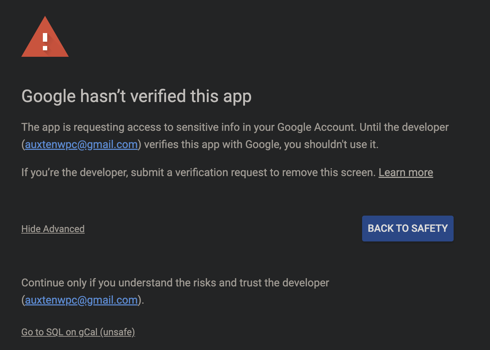
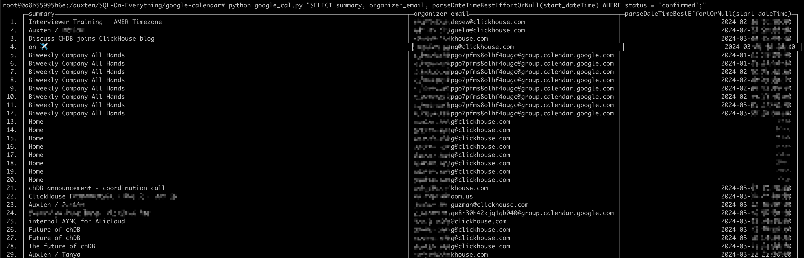

# SQL on Google Calendar


## Introduction

SQL on Google Calendar is a simple project that uses Google Calendar API to fetch events from a calendar and query it with [chDB](https://github.com/chdb-io/chdb) User Defined Table (UDT).

## Requirements

1. Clone the repository.
    ```bash
    git clone https://github.com/auxten/SQL-On-Everything.git
    cd SQL-On-Everything/google-calendar
    ```
1. Install the required packages.
    ```bash
    pip install -r requirements.txt
    ```


## Configure and Authenticate

1. Configure the Google Cloud App
    1. If you just want to try the script, you can use the existing `credentials.json` file in the repository. See the Notice section below.

    1. Or if you want to run this as a new Google Cloud App
        1. you need to enable the [Google Calendar API](https://developers.google.com/calendar/api/quickstart/python#enable_the_api) in the Google Cloud Console and download the `credentials.json` file.
        2. Replace the `credentials.json` file in the same directory with yours.

1. Run the script once to authorize the application to access your Google Calendar data. The token will be stored in a file named `token.json`. This file contains the access token and the refresh token.
    1. As Google is reviewing this simple App. You may got warning while authing on browser, please click `Advanced` and `Go to SQL on gCal (unsafe)` to continue. As all the data is processed locally (you can check the code yourself), it is safe to proceed.
    

## Usage

Usage: `python google_cal.py sql [outputFormat]`

- sql: SQL query to run on the Google Calendar data, `FROM Python(cal)` could be omitted. Eg.:
    - SELECT summary, organizer_email, parseDateTimeBestEffortOrNull(start_dateTime) LIMIT 10;;
    - DESCRIBE Python(cal)

- outputFormat: Output format, e.g. Dataframe, CSV, JSON, PrettyCompact

## Example

```bash
python google_cal.py \
 "SELECT summary, organizer_email, parseDateTimeBestEffortOrNull(start_dateTime) WHERE status = 'confirmed';"
```




## Notice

- The `credentials.json` file in the repository is for testing purposes only. It is not recommended to use it in a production environment.

- If you are using the Google Calendar API for the first time, you will be asked to authorize the application to access your Google Calendar data. The credentials will be stored in a file named `token.json`. DO NOT SHARE THIS FILE.

- If running the script on a server, you can copy the URL from the terminal and paste it in your browser to authorize the application. You can also copy existing `token.json` file to the server.
